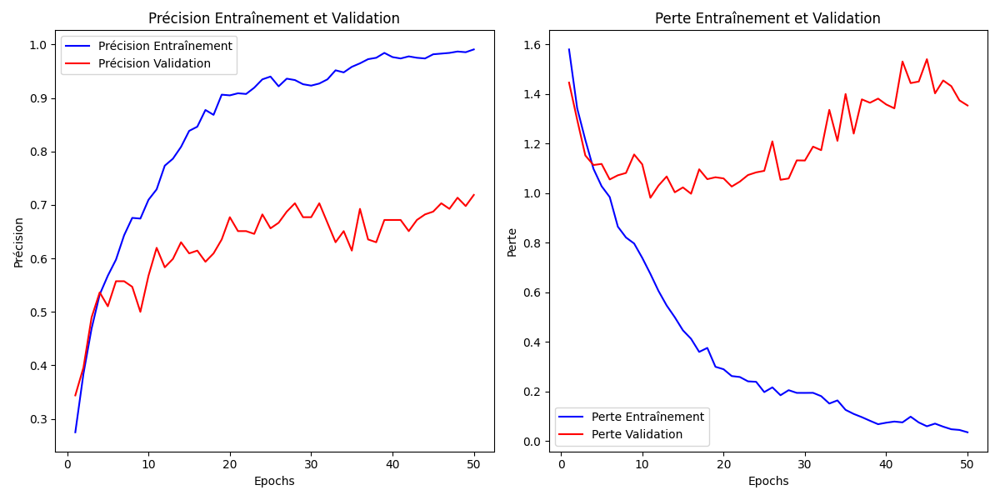
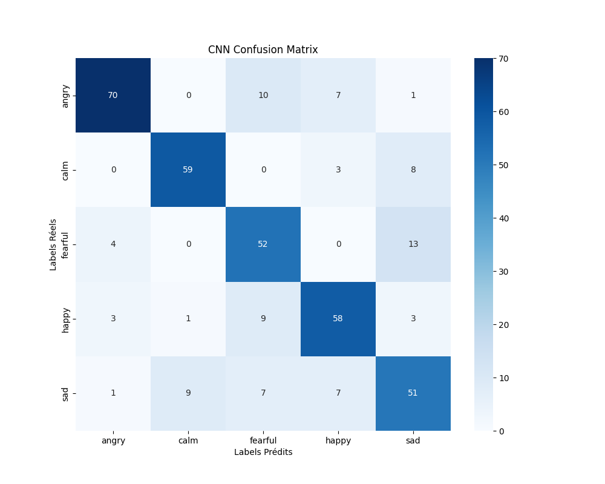

# AudioSentimentAnalysis
Projet de sentiment analysis sur le corpus audio RAVDESS
Article de référence : Singh, P. Nagrath, P. (2022). Vocal Analysis and Sentiment Discernment using AI. *Fusion: Practice and Applications*, (), 100-109. DOI: https://doi.org/10.54216/FPA.070204

## Auteurs
- AROUN Jeevya
- NGAUV Nicolas
- THEZENAS Anissa

## Usage
### 1. Télécharger le dataset

Le dataset RAVDESS Speech et Song est disponible sur Kaggle :
```console
#!/bin/bash
curl -L -o ~/Downloads/ravdess-emotional-speech-audio.zip\
  https://www.kaggle.com/api/v1/datasets/download/uwrfkaggler/ravdess-emotional-speech-audio

curl -L -o ~/Downloads/ravdess-emotional-song-audio.zip\
  https://www.kaggle.com/api/v1/datasets/download/uwrfkaggler/ravdess-emotional-song-audio
```
**ATTENTION** Il faut obligatoirement supprimer les dossiers `audio_speech_actors_01-24/` et `audio_song_actors_01-24/` présents dans les dossiers téléchargés car ils contiennent des doublons et peuvent donc influencer les résultats obtenus sur le test set.
Placer le dataset dans le dossier `data/`.

### 2. Lancer les scripts
```
python3 train_with_LSTM.py
python3 train_with_CNN.py
python3 script_svm.py
```

## LSTM Jeevya 👩🏽‍💻
Nous avons créé un script python qui permet d'entrainer un modèle LSTM sur la reconnaissance de sentiments sur des extraits audio parlés et chantés provenant du corpus RAVDESS Speech & Song.
Comme dans le papier de référence, nous utilisons uniquement les labels 'sad', 'calm', 'happy', 'angry' et 'fearful' pour essayer d'avoir une meilleur accuracy en éliminant les émotions les plus difficile à discerner.
On utilise un split train/test de respectivement 80% et 20% du corpus. L'entrainement se fait sur 70 epochs. Les hyperparamètres utilisés ne sont pas précisés dans l'article donc nous testons par nous même des valeurs. Nous obtenons avec notre modèle **66% d'accuracy** sur le test set. Dans les prochaines étapes, nous comptons utiliser GridSearch pour essayer de trouver de meilleurs hyperparamètres et améliorer l'accuracy du modèle.

## CNN Nicolas 🧑🏻‍💻

Conformément à l'article, on utilise un modèle CNN entrainé sur une partie du dataset RAVDESS (80%) pour effectuer une classification des sentiments détectés dans une autre partie du dataset RAVDESS (20%), afin d'évaluer le modèle CNN.

Les CNN détectent des motifs dans des matrices comme les MFCC, à travers des couches convolutionnelles, d'activation et de pooling. Cela permet de construire des modèles capables de classifier les données avec efficacité.

Dans les prochaines étapes, on essaiera de jouer avec la régularisation (Dropout ou L2) et/ou un apprentissage plus lent et progressif (avec un learning rate scheduler) pour essayer de stabiliser l'entraînement, d'éviter le sur-apprentissage et d'améliorer la capacité de généralisation du modèle.

### Résultats :



**Training Accuracy** : 97,93%

**Validation Accuracy** : 71,88%

**Training Loss** : 1,357

**Validation Loss** : 0,036




La matrice de confusion permet d'analyser les prédictions correctes et incorrectes par rapport aux étiquettes réelles des données de test. Voici ce que l'on observe avec l'hypothèse d'association des classes suivante :

Classe 0 → Angry<br>
Classe 1 → Calm<br>
Classe 2 → Fearful<br>
Classe 3 → Happy<br>
Classe 4 → Sad<br>

Observations détaillées :

Angry (0) :<br>
Prédictions Correctes : 26<br>
Prédictions Incorrectes : 5 prédictions vers la classe "Happy" (3).<br>
Interprétation : Le modèle parvient généralement à bien reconnaître la classe "Angry", mais une confusion persiste avec "Happy". Cela peut s'expliquer par des caractéristiques acoustiques similaires entre des émotions intenses comme la colère et le bonheur.

Calm (1) :<br>
Prédictions Correctes : 25<br>
Prédictions Incorrectes : 3 erreurs vers "Happy" (3) et 6 erreurs vers "Sad" (4).<br>
Interprétation : Les échantillons "Calm" sont souvent confondus avec "Happy" et "Sad". Cela est compréhensible, car une voix calme peut être difficile à distinguer d'une voix légèrement triste ou posée dans le contexte audio.

Fearful (2) :<br>
Prédictions Correctes : 33<br>
Prédictions Incorrectes : 2 erreurs vers "Calm" (1), 2 vers "Happy" (3), et 5 vers "Sad" (4).<br>
Interprétation : Le modèle reconnaît bien "Fearful" dans la majorité des cas, mais il semble confondre la peur avec des états tristes ou calmes. Ceci peut indiquer que certaines caractéristiques acoustiques associées à la peur (comme un ton bas ou tremblant) peuvent ressembler à celles d'une tristesse prononcée.

Happy (3) :<br>
Prédictions Correctes : 24<br>
Prédictions Incorrectes : 6 erreurs vers "Angry" (0), 2 vers "Calm" (1), 3 vers "Fearful" (2), et 5 vers "Sad" (4).<br>
Interprétation : La classe "Happy" est souvent confondue avec les autres émotions, notamment "Angry" et "Sad". Cela peut être dû à la diversité des expressions vocales du bonheur, qui peuvent parfois être interprétées comme des émotions intenses ou mélancoliques.

Sad (4) :<br>
Prédictions Correctes : 30<br>
Prédictions Incorrectes : 1 erreur vers "Angry" (0), 8 vers "Calm" (1), et 5 vers "Fearful" (2).<br>
Interprétation : "Sad" est globalement bien reconnue, mais il existe des confusions significatives avec "Calm". Cette confusion est fréquente dans les modèles de classification audio, car des émotions comme la tristesse et le calme partagent souvent des tonalités douces et des rythmes lents.


## SVM (Support Vector Machine) Anissa👩🏾‍💻

### Objectif

Le modèle SVM est utilisé pour effectuer une classification des émotions détectées dans le corpus audio. SVM est un algorithme d’apprentissage supervisé qui sépare les différentes classes en maximisant la marge entre celles-ci grâce à un hyperplan optimal.

### Rapport de classification :

| **Classe** | **Précision** | **Rappel** | **F1-Score** | **Support** |
|------------|--------------:|-----------:|-------------:|------------:|
| 0          | 0.66          | 0.81       | 0.72         | 31          |
| 1          | 0.81          | 0.74       | 0.77         | 34          |
| 2          | 0.80          | 0.67       | 0.73         | 42          |
| 3          | 0.64          | 0.57       | 0.61         | 40          |
| 4          | 0.62          | 0.71       | 0.66         | 45          |

### Moyenne et Accuracy :

| **Métrique**      | **Valeur** |
|-------------------:|----------:|
| **Accuracy**      | 0.69      |
| **Macro Average** | 0.70      |
| **Weighted Avg**  | 0.70      |

